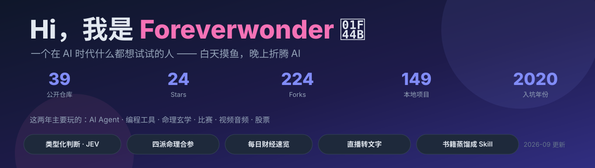
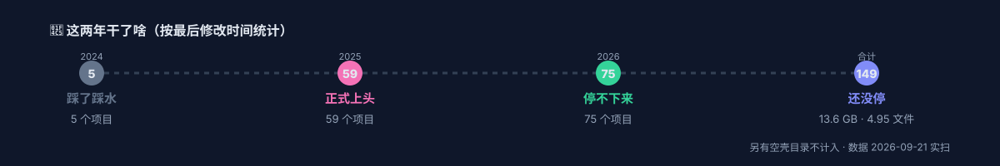
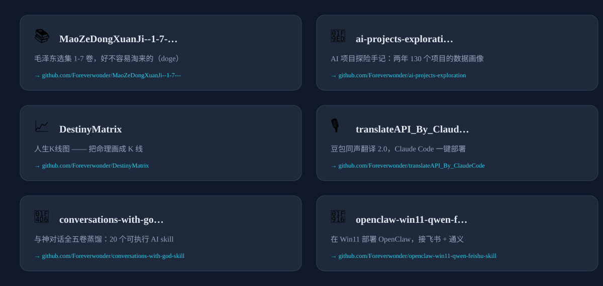

# Hi，我是 Foreverwonder 👋

一个在 AI 时代什么都想试试的人。白天摸鱼，晚上折腾 AI，周末偶尔给老祖宗打工（算命）。

## 🧭 这两年我在玩什么

2024 年踩了踩水，2025 年下半年开始正式上头，然后就没停下来过。D 盘那个 AI 项目文件夹，现在攒了 **149 个项目、13.6 GB、4.95 万个文件**——我又翻了一遍，把那份数据画像整个更新了：

👉 **[AI_Projects 探险手记](https://foreverwonder.github.io/ai-projects-exploration/)**（在线可看）

翻完有两个发现挺意外的：一是命理玄学的浓度比我自己以为的高；二是占地方的根本不是代码——一个视频素材文件夹就吃掉 5.5 GB，而大多数项目本体只有几百 KB。

**小实验一堆，偶尔憋个大的。**

## 🚀 精选项目

- 🧭 **ai-projects-exploration** —— 两年 149 个 AI 项目的数据画像，只读扫出来再画成图
- 📖 **conversations-with-god-skill** —— 《与神对话》全五卷，蒸馏成 20 个能直接跑的 skill
- 🔮 **sihe-paipan** —— 八字 + 紫微 + 奇门 + 六爻，一个时间四盘齐排、交叉验证
- 📈 **DestinyMatrix** —— 把命理走势画成 K 线，主要给自己看
- 📰 **daily-finance-digest** —— 财经要闻自动翻译加归档，工作日早上的例行工具
- ⚙️ **governance-circuit** —— 给 AI skill 装治理电路：契约、路由、证据、审查
- 🩺 **jev-disk-mvp** —— 只读磁盘体检 —— 给每个文件夹打个「删不删」的判断加把握度，它敢说自己哪几处看不准，而且一个文件都不动
- 🔯 **dualring-365** —— 一年 365 天，一天一张双环合参盘（八字 + 紫微 + 奇门 + 黄历），离线算完压成一个 HTML

另外还有几个私有仓库，涉及个人数据，就不放出来了。

## 🔮 说点正经的

- 🔭 目前在折腾：AI Agent、编程工具、模型测试，还有「AI 什么时候该承认自己不知道」这件事
- 🌱 也在玩：命理玄学（八字 / 六爻 / 印占）、比赛、视频音频处理
- 💬 找我聊：AI、编程、玄学，或者你也在折腾的东西
- 📫 想联系我：直接在我仓库里开 Issue 就行，我会看到的

## 📊 数据一览

| 维度 | 数字 |
|---|---|
| 公开仓库 | 41 个（其中自建 31 个）|
| 私有仓库 | 16 个 |
| 自建项目获星 | 6 星 · 1 fork |
| 本地 AI 项目 | 149 个 · 13.6 GB · 4.95 万文件 |
| 第一行代码进 GitHub | 2020 年 1 月 |

> 「获星」只算自己写的，不含 fork、不含收藏归档。另外挂着两个毛选电子书仓库，合计 18 星 223 fork —— 那是别人要的资源，不往自己脸上贴。

> 主页数字是只读脚本从真实仓库和真实硬盘扫出来、直接烘焙进 SVG 的，不接任何外部服务，永远不挂。

---
*这个主页也是我用 AI 折腾出来的。*
